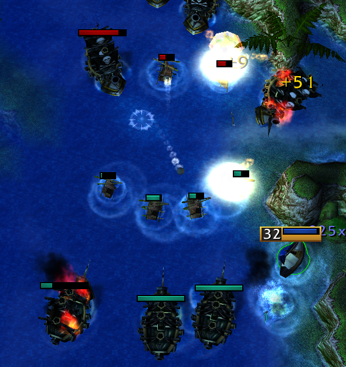

# Battlships Crossfire - Quick Start Guide

This guide is made to help those who are starting to play or revisiting the game.

- Written as of version 5.00 - Beta 11

> Please turn on **show unit health bars** and **team color health bars**. This is accessed in the following:
>
> $Options \rightarrow gameplay \rightarrow show\space unit\space life\space bars \rightarrow always$
>
> $Options \rightarrow gameplay \rightarrow team\space colored\space life\space bars$
>
> 

## General Ability Build Order

Generally, you want to prioritizing skilling your main abilities and then ship sail speed, but some skills only need one point or take less priority than sail speed (e.g. Water Waver only needs 1 point into Intercept skill, so prioritize order is as follows:
$ Water\space Wave \rightarrow Intercept(1 point)\rightarrow Upgraded \space Sails$). However, keep in mind that skill points usage is situational.

## Early Game

This is the early game section. The typical strategy is you buy a **stone hull, light sail, and repair crew** or a **great sail** for coin-rushing. You can also buy some extra dps for early pushing & zone holding.

> Not landing last hits on creeps will *not* end up losing gold. The Empire will gain this gold and split the gold with your team. The gold is distributed every 5 minutes.

> DO NOT STACK DAMAGE EARLY GAME! This is because your weapon should reflect the ship choice you are using later in the game. (e.g. ships with long range abilities should use medium/long range weapons). And because team ship composition is dynamic (dependent on team/enemy ship composition), you would not know this early game. You also want to be able to **share damage**. A low health ship, especially one with no hull, is useless in team fights. Also, stacking weapons early will lead to **creep hoarding**, where the ship with higher dps will typically ends up having the most creep kills, hoarding all the gold.

### Battlezones

Early game, if battlezones selected, relies on controlling the zones and working with teammates to land kills. Sailor's **Captain's Cannon** (also known as "CC") causes damage and ministun. With enough teamwork, you can synchonize your CCs to land a kill. When holding the zones, you want to position yourself to hold the zones while pushing/damaging enemy ships. However, holding zones makes you vulnerable, as you are out in the open (the enemy knows your there based on the "+3" team color). Outer zones makes you more seen, but you have more vision, and inner zones makes you more hidden but more susceptible to surprise attacks. If ships of two different teams are holding a zone, neither team gain gold from zones.

> Holding zones on the left or right side will **decrease exp gained**. This is because you are not in range of the other lane of creeps. You should strategize the zone holding location on the basis of what ship you are going (e.g. raft needs levels so staying in the middle may be better).

### Coins

Getting coins is an important aspect of early game, as coins helps your team gain more early gold for faster $1200g$ and $3000g$ ships. If a team manages to get all the coins, they are at a huge early advantage. There are $5$ total (**middle, left, right, far upper-left corner, far lower-right corner**). Each coin collected gains *$130g$* for the collector, and *$100g$* for the team. This is reflected in the **loot menu**, as you can see how many coins (based on the gold gained) each team collects. The general strategy is to buy a **great sail** and rush for the coins before the other team. However, this leaves coin-rushers *without a hull*, making them vulnerable. Because of this, teams will typically try to intercept coin-rushers for free early kills.

> **Hint**: Using **shift-click** helps to plan your path *before* the game starts. The **starting position** also affects the access to the shop. Ships that are spawned more to the left have earlier access to the shop. With enough practice, you can buy the great sail from the shop without stopping for the coin!

### 1200g & 3000g Ships

The timing of team and enemy 1200g ship composition is critical for early game zone dominance. Your *item composition* is important based on the enemy team ship composition. There is a balance of how many ships of  $1200g$ and $3000g$ cost, composition, and counter composition. Here are some main points:

> **Hint:** the raft's **stolen cannon** can be leveled up each level (as opposed to every other level). This means the raft can typically one-shot ships without a hull.
> - level 1: $105$ dmg
> - level 2-6: $ 105 + 110(n-1)$ dmg, where $n$ is the level of the ship.
> This means a level 6 raft can do $655$ dmg!

The general strategy is to have a balanced team composition while incorporating timing and battle-zoning. You do not want all the teammates to go $1200g$ ships, and you do not want all teammates to go $3000g$ ships. *You want to choose one of the two ship prices*. The typical upgrade path is as follows:

$$
1200g\rightarrow 5000g\rightarrow 10000g\rightarrow 14000g \\
or \\
3000g\rightarrow 7000g\rightarrow 14000g
$$
Therefore, we can calculate the gold needed to upgrade based on the sell. The resell price is $50\%$ of the original:

$$ gold\space needed = (ship\space cost) + 0.5\times(previous\space cost) $$

| Ship Cost | Gold Needed |
| ----      |    ----     |
| 1200g     |             |
| 3000g     |             |
| 5000g     | 4400g       |
| 7000g     | 5500g       |
| 10000g    | 7500g       |
| 14000g    | 10500g      |

This guide will not go into the minutae of each ship, but some general combos are used below.

| Ship Combos | Description |
| ---- | ---- |
| Raft + Bombardier | Flare $\rightarrow$ stolen cannon weak/underleveled sailors |
| Crusader/Raft/Corvette/Cog/Battleturtle + Flameship | Net $\rightarrow$ flamestrike |
| Normandier |
| Dwarfish |
| Cog |
| Raft/Bombardier + Druid | Flare $\rightarrow$ snake |
| Brigg/Trieme/HMAV/Potemkin + Flameship | Stun $\rightarrow$ flamestrike |
|Overlord + Flameship | Freeze $\rightarrow$ Flamestrike |
| Brigade/Strike + Galleon | Hook $\rightarrow$ board |
| root/stun + Storm wind | any crowd control (slows, roots, stuns) $\rightarrow$ AoE storm |
| Alcoholic/Ganja + Houseboat/Marauder | Damage amplify $\rightarrow$ orbs |
| Barque + Brigade/Strike | "X" $\rightarrow$ hook |
| Sea Shepard + Flameship | "Boop" (stun) $\rightarrow$ Flamestrike |

## Traders
| Ship | Type | Strong Against | Weak Against |
| ---- | ---- | ---- | ---- |
| Trader | --- | Flare ships and minelayers |
| Merchant | --- | Flare ships and minelayers |

## Scouters
| Ship | Type | Strong Against | Weak Against |
| ---- | ---- | ---- | ---- |
| Sea Punisher | ??? | Any crowd control/disrupt |
| Bombardier | Hookers | Ships with long range abilities |
| Dwarfish | Weaker ships and Hookers | Flare ships |
| Schooner |

## Summoners
| Ship | Type | Strong Against | Weak Against |
| ---- | ---- | ---- | ---- |
| Corvette | Sailors and weak ships | Ships with long range abilities |
| Druid | Early game ships | Ships that slow and ships that scout |
| Juggernaut | Buildings | Ships with AoE Damage/remove summons abilities |
| Doublejugger |

## Healers/Supporters
| Ship | Type | Strong Against | Weak Against |
| ---- | ---- | ---- | ---- |
| Advanced Repair ship | Support | Teams with no crowd control | stunners/silencers/disrupters |

## Nukers
| Ship | Type | Strong Against | Weak Against |
| ---- | ---- | ---- | ---- |
| Crusader | Sailors | Crowd control, especially nets |
| Raft | Sailors | Stronger ships (3k+) |
| Dominator | Weak ships | Scouters |
| Alcoholic | Ships with no detection | Flare and units that can detect invisible units/goblin scope |
| Fireships | Every ship with combo (i.e. stun into flame) | ships with disrupt or crowd control |
| Trireme | Weaker ships | Silencers, dispellers, slowers, and faster ships |
| Flameship (3k,7k,14k) | Teams with no silencers/disrupters | silencers/disrupters |

## Crowd Controllers
| Ship | Type | Strong Against | Weak Against |
| ---- | ---- | ---- | ---- |
| Brigg | Early game ships (with combo) and bunching | Silencers/disrupters |
| Cog | Slower ships | Faster ships and LoS |
| Cloudship | Ships with short range abilities | Ships with long range abilities |
| Overlord | Non-scouter ships | Scouters and silencers/disrupters |
| HMAV Bounty | Ships with no silencers/disrupters | Silencers/disrupters |
| Trapper |
| Troll Destroyer |
| Carrack |
| Storm Wind |
|

## Assassins
| Ship | Type | Strong Against | Weak Against |
| ---- | ---- | ---- | ---- |
| Normandier | Sailors | Stronger ships |
| Puddle skipper | Weak ships | Strong ships and invisibility detection |
| Goblin | Crowd controlled ships | Faster ships |
| Houseboat | Weaker ships | Strong ships and fast ships |
| Viking's Revenge | Weak ships and Hookers | Ships with long range abilities |
| Marauder |
| Battleturtle |
| Red October |
| Papayadealer |

## Initiators
| Ship | Type | Strong Against | Weak Against |
| ---- | ---- | ---- | ---- |
| Asian |
| Barque |

## Mine-Layers

## Hookers
| Ship | Type | Strong Against | Weak Against |
| ---- | ---- | ---- | ---- |
| Brigade |

## Dispellers
| Ship | Type | Strong Against | Weak Against |
| ---- | ---- | ---- | ---- |
| Ship of the line | Crowd controllers |
| Ganja |

## Silencers/Disrupters
Silencing is extremely stronk.
| Ship | Type | Strong Against | Weak Against |
| ---- | ---- | ---- | ---- |
| Intercepter | Sailors and channel casting ships (i.e. flame ship) | Non-single target abilites (i.e. AoE stuns) |
| Destroyer | Weaker Ships and ships with short range abilities | Any ships with crowd control/counter |
| Nautilus | Weak ships and ships that channel their abilities | Ship that can detect invisible (flare), scope |
| Galleon | Ships that use close-ranged abilities | Ships that use far-ranged abilities |
| Waterwaver | Ships that channel their abilities and ships that cast debuffs (i.e. slows/roots) | Stuns

<!-- Some general strategies and synergies arise described below:

**Crusader**

Crusader is a suicide/crowd control ship, which has a strong nuke at the cost of suiciding. The crusader gains exp from the ship it kills.

Capsize: *Suicides, dealing major dmg and minor splash damage*.
| Level | Damage (single) | Damage (splash) | Cooldown | Requires Level |
|   :-: |       :-:       |        :-:      |    :-:   |      :-:       |
| 1     | 300             | 150             | 150s     |               |
| 2     | 500             | 210             | 210s     |               |
| 3     | 700             | 270             | 270s     |               |
| 4     | 900             | 330             | 330s     |               |
| 5     | 1150            | 390             | 390s     |              |
| 6     | 1450            | 450             | 450s     |              |

Net: Nets a ship, making it unable to move for $2$ seconds.
> Requires captain level 2

**Interceptor**

Interceptor is a strong aggressor with strong early game on-board dps. Typically, teammates will give the interceptor their basic cannons to increase pressure. Interceptors are hard to kill. A solid choice to start with.

** -->
